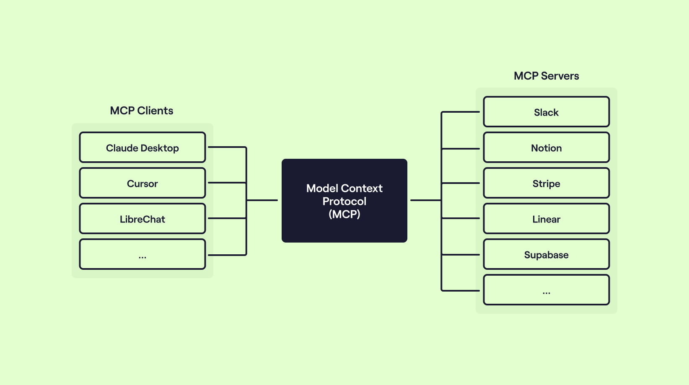
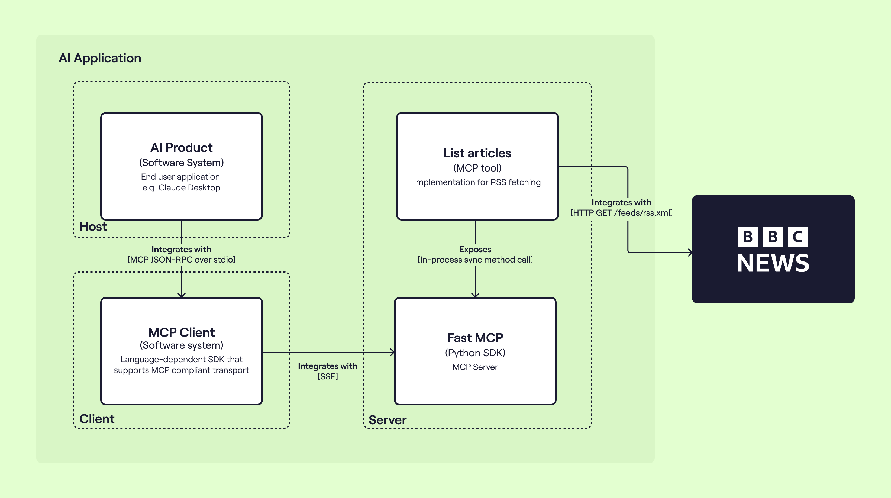
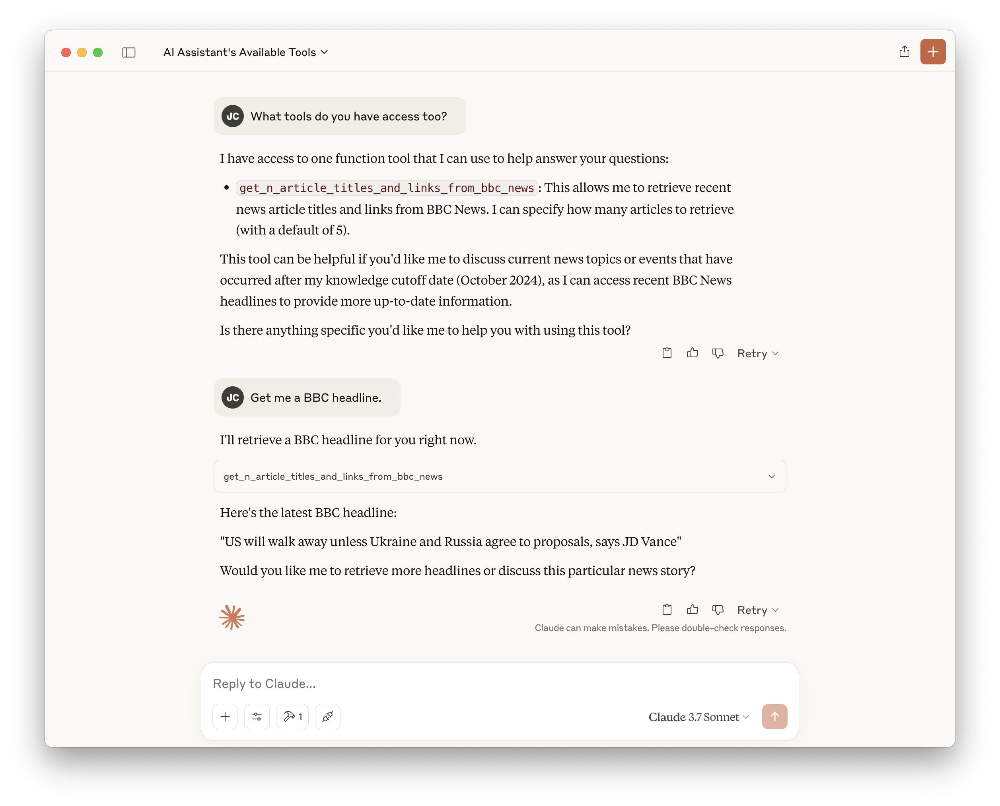

# Hyperact's BBC News MCP Server Demo



An example MCP Server running locally, utilising [FastMCP]() and [Feedparser]() to expose the latest live [BBC News](https://feeds.bbci.co.uk/news/rss.xml) articles into Claude Desktop.

This repository accompanies the [Hyperact](http://hyperact.co.uk/blog/should-i-adopt-mcp-as-part-of-my-api-product-strategy) blog post [Should I adopt MCP as part of my API Product strategy](http://hyperact.co.uk/blog/should-i-adopt-mcp-as-part-of-my-api-product-strategy).



## Setting up

Assuming you're on macOS, with [Claude Desktop](https://claude.ai/download) installed and logged in, grab `uv` via brew:

```shell
brew install uv
```

Make sure you have a modern Python runtime installed, pinned and dependencies gathered:

```shell
uv install python 3.12
uv pin python 3.12
uv venv
uv pip install .
```

Finally, you can install the MCP server into Claude Desktop: 

```shell
uv run mcp install 
```

Restart Claude Desktop, you can then ask it "What tools do you have access too?" and "Get me a BBC headline.".


